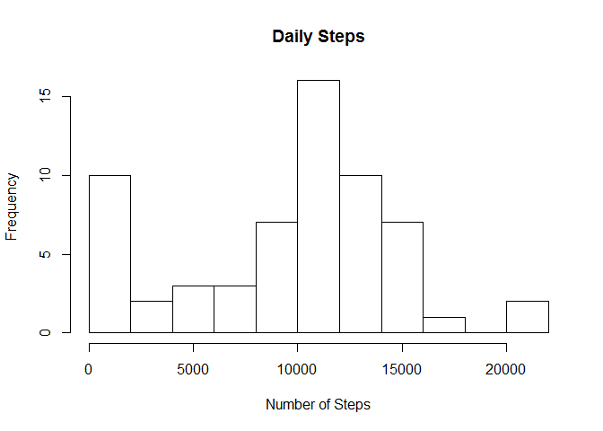
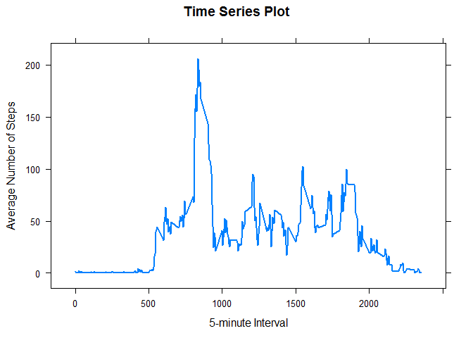
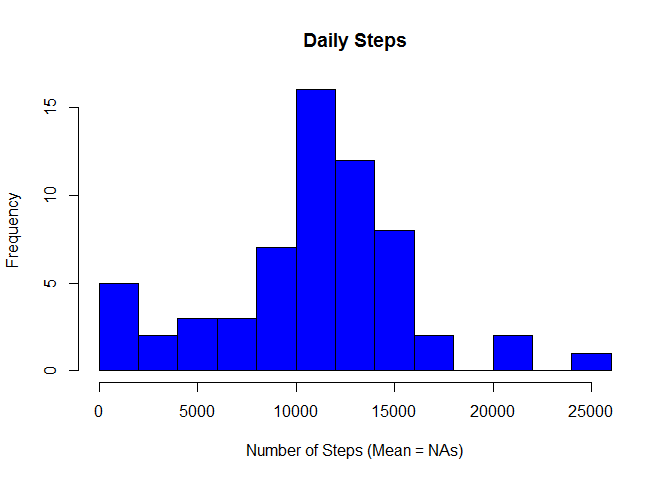
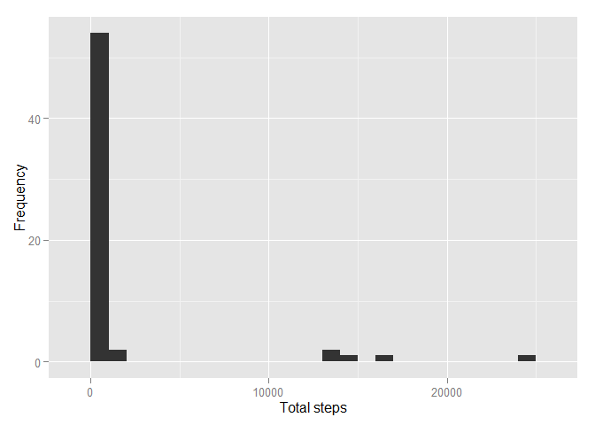
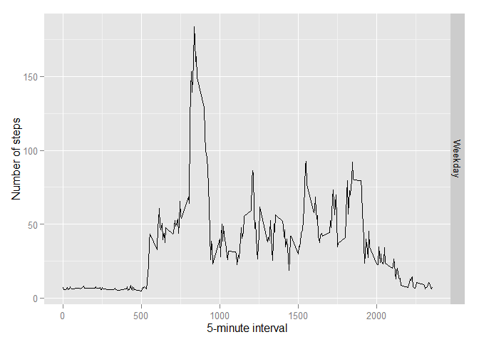

# Reproducible Research: Peer Assessment 1

Load packages

```r
library(ggplot2)
library(plyr)
library(lubridate)
library(lattice)
library(knitr)
```

## Loading and preprocessing the data

```r
data <- read.csv( unzip("activity.zip"),
                sep=",",
                na.strings = "NA",
                colClasses =c("numeric","Date","numeric"))
str(data)
```

```
## 'data.frame':	17568 obs. of  3 variables:
##  $ steps   : num  NA NA NA NA NA NA NA NA NA NA ...
##  $ date    : Date, format: "2012-10-01" "2012-10-01" ...
##  $ interval: num  0 5 10 15 20 25 30 35 40 45 ...
```

## What is mean total number of steps taken per day?
For this part of the assignment, the missing values in the dataset are ignored. 1. Make a histogram of the total number of steps taken each day 2. Calculate and report the mean and median total number of steps taken per day


```r
steps_day <- tapply(data$steps,data$date,function(x) sum(x,na.rm=TRUE))
hist(steps_day, breaks = 15, xlab="Number of Steps", main="Daily Steps")
```

 

```r
#Mean total number of steps taken per day:
steps_mean <-mean(steps_day, na.rm = T)
steps_mean
```

```
## [1] 9354.23
```


```r
#Median total number of steps taken per day:
steps_median<- median(steps_day,na.rm=TRUE)
steps_median
```

```
## [1] 10395
```


```r
summary(steps_day)
```

```
##    Min. 1st Qu.  Median    Mean 3rd Qu.    Max. 
##       0    6778   10400    9354   12810   21190
```
## What is the average daily activity pattern?


```r
steps_pattern <- aggregate(data$steps ~ data$interval, data, FUN=mean, na.rm=T)

names(steps_pattern) <- c("interval","average_steps")

xyplot(steps_pattern$average_steps ~ steps_pattern$interval, 
       type = "l", ylab = "Average Number of Steps", 
       xlab ="5-minute Interval",
       main = "Time Series Plot", lwd = 2)
```

 


```r
max_steps <- which.max(steps_pattern$average_steps)
max_steps
```

```
## [1] 104
```


## Imputing missing values

Note that there are a number of days/intervals where there are missing values (coded as NA ). The presence of missing days may introduce bias into some calculations or summaries of the data. 1. Calculate and report the total number of missing values in the dataset (i.e. the total number of rows with NA s)

```r
sum(is.na(data$steps))
```

```
## [1] 2304
```

Devise a strategy for filling in all of the missing values in the dataset. The strategy does not need to be sophisticated. For example, you could use the mean/median for that day, or the mean for that 5- minute interval, etc.


```r
sub_nas <- data[is.na(data),]
sub_nas$steps <- merge(steps_pattern, sub_nas)$average_steps
```

Create a new dataset that is equal to the original dataset but with the missing data filled in.


```r
# create the new dataset 
data_fill <- data
data_fill[is.na(data),] <- sub_nas
daily_steps_fill <- tapply(data_fill$steps,data_fill$date,function(x) sum(x,na.rm=TRUE))
```

Make a histogram of the total number of steps taken each day and Calculate and report the mean and median total number of steps taken per day. Do these values differ from the estimates from the first part of the assignment? What is the impact of imputing missing data on the estimates of the total daily number of steps?


```r
hist(daily_steps_fill, breaks = 15, col="blue",xlab="Number of Steps (Mean = NAs)", main="Daily Steps")
```

 


```r
qplot(daily_steps_fill-steps_day, binwidth = 1000, xlab='Total steps', ylab='Frequency')
```

 

## Are there differences in activity patterns between weekdays and weekends?

The dataset with the filled-in missing values is used. 1. A new factor variable is created in the dataset with two levels – “weekday” and “weekend” indicating whether a given date is a weekday or weekend day. 2. A panel plot containing a time series plot (i.e. type = “l” ) of the 5-minute interval (x-axis) and the average number of steps taken is constructed, averaged across all weekday days or weekend days (y-axis).


```r
daytype <- function(date) {
        if (weekdays(as.Date(date)) %in% c("Saturday", "Sunday")) {
                "Weekend"
        } else {
                "Weekday"
        }
}
data_fill$daytype <- as.factor(sapply(data_fill$date, daytype))
data_fill$day <- sapply(data_fill$date, FUN = daytype)

averages <- aggregate(steps ~ interval + day, data = data_fill, mean)
ggplot(averages, aes(interval, steps)) + geom_line() + facet_grid(day ~ .)+
  xlab("5-minute interval") + ylab("Number of steps")
```

 

There are no obvious differences in activity patterns between weekdays and weekends.

